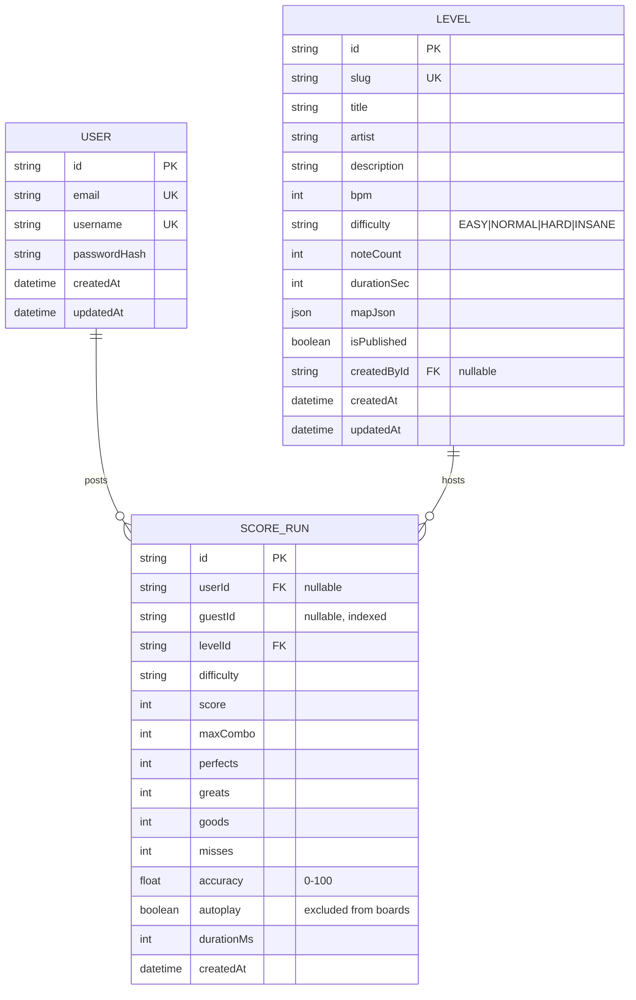

# Tap & Slap — Database Schema & Data Models

| | |
|---|---|
| **ORM** | Prisma 6 |
| **Dev DB** | SQLite (`prisma/dev.db`, zero-config) |
| **Prod DB** | PostgreSQL (portable schema; switch provider + `prisma migrate deploy`) |
| **Migrations** | `prisma/migrations/0001_init/migration.sql` (generated) |

---

## 1. Entity-Relationship diagram



---

## 2. Canonical SQL (target: PostgreSQL)

```sql
CREATE TABLE "User" (
    "id"           TEXT PRIMARY KEY,
    "email"        TEXT NOT NULL UNIQUE,
    "username"     TEXT NOT NULL UNIQUE,
    "passwordHash" TEXT NOT NULL,
    "createdAt"    TIMESTAMP NOT NULL DEFAULT CURRENT_TIMESTAMP,
    "updatedAt"    TIMESTAMP NOT NULL
);

CREATE TABLE "Level" (
    "id"          TEXT PRIMARY KEY,
    "slug"        TEXT NOT NULL UNIQUE,
    "title"       TEXT NOT NULL,
    "artist"      TEXT NOT NULL,
    "description" TEXT NOT NULL,
    "bpm"         INTEGER NOT NULL,
    "difficulty"  TEXT NOT NULL CHECK ("difficulty" IN ('EASY','NORMAL','HARD','INSANE')),
    "noteCount"   INTEGER NOT NULL,
    "durationSec" INTEGER NOT NULL,
    "mapJson"     JSONB NOT NULL,
    "isPublished" BOOLEAN NOT NULL DEFAULT true,
    "createdById" TEXT,
    "createdAt"   TIMESTAMP NOT NULL DEFAULT CURRENT_TIMESTAMP,
    "updatedAt"   TIMESTAMP NOT NULL,
    CONSTRAINT "Level_createdById_fkey" FOREIGN KEY ("createdById")
        REFERENCES "User"("id") ON DELETE SET NULL
);

CREATE TABLE "ScoreRun" (
    "id"         TEXT PRIMARY KEY,
    "userId"     TEXT,
    "guestId"    TEXT,
    "levelId"    TEXT NOT NULL,
    "difficulty" TEXT NOT NULL,
    "score"      INTEGER NOT NULL,
    "maxCombo"   INTEGER NOT NULL,
    "perfects"   INTEGER NOT NULL,
    "greats"     INTEGER NOT NULL,
    "goods"      INTEGER NOT NULL,
    "misses"     INTEGER NOT NULL,
    "accuracy"   DOUBLE PRECISION NOT NULL,
    "autoplay"   BOOLEAN NOT NULL DEFAULT false,
    "durationMs" INTEGER NOT NULL,
    "createdAt"  TIMESTAMP NOT NULL DEFAULT CURRENT_TIMESTAMP,
    CONSTRAINT "ScoreRun_userId_fkey"  FOREIGN KEY ("userId")  REFERENCES "User"("id") ON DELETE CASCADE,
    CONSTRAINT "ScoreRun_levelId_fkey" FOREIGN KEY ("levelId") REFERENCES "Level"("id") ON DELETE CASCADE
);

-- Leaderboard reads: exact prefix match on (level, difficulty, score).
CREATE INDEX "ScoreRun_leaderboard_idx"
    ON "ScoreRun" ("levelId", "difficulty", "score" DESC);
CREATE INDEX "ScoreRun_user_idx"   ON "ScoreRun" ("userId", "createdAt" DESC);
CREATE INDEX "ScoreRun_guest_idx"  ON "ScoreRun" ("guestId", "createdAt" DESC);
CREATE INDEX "ScoreRun_autoplay_idx" ON "ScoreRun" ("autoplay");
```

> The committed SQLite migration is generated from `prisma/schema.prisma`
> (`prisma/migrations/0001_init/migration.sql`); the DDL above is the
> Postgres-shaped reference. `difficulty` is stored as a string (Prisma
> enums are unsupported on SQLite) and validated by the Zod layer.

---

## 3. Data models (domain view)

### User
| Field | Type | Notes |
|---|---|---|
| id | cuid | PK |
| email | string, unique | normalized lowercase, ≤254 chars |
| username | string, unique | `[a-zA-Z0-9_-]{3,20}` |
| passwordHash | string | bcrypt, cost 12 (never returned by API) |
| createdAt / updatedAt | datetime | |

Guests are **not** users: they carry a client-generated UUID (`guestId`) on
ScoreRun. This keeps sign-up friction at zero while preserving attribution.

### Level
| Field | Type | Notes |
|---|---|---|
| slug | string, unique | URL-safe id used by API & game (`first-beat`, …) |
| mapJson | JSON | serialized `BeatMap` (bpm, offsetMs, approachBeats, bars, sections, notes) |
| difficulty | string | EASY / NORMAL / HARD / INSANE |
| noteCount / durationSec | int | denormalized for leaderboard UI (no JSON parse on read) |
| isPublished | bool | content-pipeline flag (future editor) |
| createdById | FK nullable | future UGC attribution |

MVP rows are **seeded mirrors of the code registry** (`prisma/seed.ts`
regenerates them from `registry.ts` so they can never drift).

### ScoreRun
| Field | Type | Notes |
|---|---|---|
| userId / guestId | FK / string | exactly one is set for a run (or neither for autoplay QA) |
| score | int | integrity-checked server-side |
| maxCombo, perfects, greats, goods, misses | int | judgment breakdown |
| accuracy | float | weighted 0–100: `(P + 0.7G + 0.4O) / total × 100` |
| autoplay | bool | QA runs flagged; excluded from leaderboards and bests |
| durationMs | int | sanity-checked (≥ 70% of map duration) |

---

## 4. Indexing rationale

- `(levelId, difficulty, score DESC)` serves **the** hot query: leaderboard
  prefix scan + `countBetter` rank computation.
- `(userId|guestId, createdAt)` serves "my recent runs".
- `autoplay` filter index keeps QA data out of leaderboard scans.

## 5. Migration & seed workflow

```bash
npm run db:migrate   # dev: prisma migrate dev (creates next migration)
npm run db:setup     # dev: migrate + seed
npm run db:deploy    # prod: prisma migrate deploy
npm run db:seed      # idempotent upserts (safe to re-run)
```

## 6. Data lifecycle & integrity rules

1. **Writes only through services** (`score-service`, `user-service`) — routes
   never call `prisma` directly except read-only lookups.
2. **Server re-validates every run** before insert (see docs/05 §Anti-cheat).
3. **Cascade deletes**: removing a user removes their runs (GDPR-friendly);
   removing a level cascades its runs.
4. **Retention**: guest runs are retained indefinitely at MVP scale; add a
   TTL job when volume demands (documented Phase 3).
