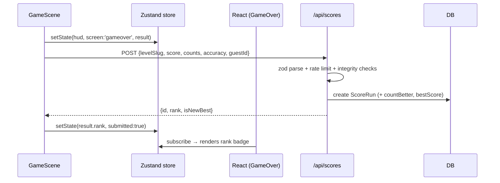

# Tap & Slap — API & Interface Specifications

Base URL: `/api` (same origin — monolith). All JSON. Errors use a uniform
envelope; clients also share the same DTO types (`src/types/api.ts`).

---

## 1. Conventions

**Success** → 2xx, typed JSON. **Error** → HTTP status + envelope:

```json
{ "error": { "code": "VALIDATION_FAILED", "message": "…", "details": { } } }
```

| Code | Meaning |
|---|---|
| `VALIDATION_FAILED` | Zod schema rejection (details = flatten()) |
| `INVALID_JSON` | Body not parseable |
| `INVALID_RUN` | Score failed integrity checks (`details.reason`) |
| `GUEST_ID_REQUIRED` | Anonymous submit without guestId |
| `UNAUTHORIZED` / `FORBIDDEN` | Auth issues |
| `NOT_FOUND` | Unknown level/route |
| `DUPLICATE` | Email/username taken |
| `RATE_LIMITED` | 429 + `Retry-After` header |
| `INTERNAL` | 500 (never leak details) |

---

## 2. Endpoints

### `GET /api/health` — liveness
```json
{ "status": "ok", "version": "0.1.0", "time": "…", "db": "up" }
```
503 when DB probe fails.

### `POST /api/auth/register` — create account
Request:
```json
{ "email": "player@example.com", "username": "SlapKing", "password": "hunter2hunter" }
```
201:
```json
{ "user": { "id": "c…", "email": "player@example.com", "username": "SlapKing" } }
```
409-ish (`DUPLICATE`) on taken email/username. Rate limit: 10/min/IP.

### `POST /api/auth/callback/credentials` — sign in (Auth.js)
Standard Auth.js v5 credentials flow (CSRF token + credentials); client uses
`signIn("credentials", { redirect: false })` from `next-auth/react`. JWT
session cookie `authjs.session-token` (30 days).

### `GET /api/me` — current user
200 `{ "user": { id, email, username } }` · 401 when signed out.

### `GET /api/levels` — level metadata
```json
{ "levels": [ { "slug": "first-beat", "title": "First Beat", "artist": "…",
  "difficulty": "EASY", "bpm": 92, "noteCount": 274, "durationSec": 167, "bars": 64 } ] }
```

### `GET /api/levels/:slug` — full level (incl. beat map)
```json
{ "level": { "slug": "…", "map": { "bpm": 92, "offsetMs": 0, "approachBeats": 4,
  "bars": 64, "sections": [ { "name": "Intro", "startBar": 0, "endBar": 4, "style": "intro" } ],
  "notes": [ { "beat": 0.5, "lane": 2, "kind": "normal" } ] } } }
```
Serves the code registry (content-as-code); 404 for unknown slugs.

### `GET /api/scores` — leaderboard
Query: `level` (slug, optional) · `difficulty` (optional) · `limit` (1–50, default 10)

```json
{ "entries": [ { "id": "…", "name": "DemoSlapper", "isGuest": false,
  "score": 313094, "maxCombo": 318, "accuracy": 92.98,
  "difficulty": "HARD", "createdAt": "2026-08-02T…" } ] }
```
Guests appear as `Guest-xxxxxxxx`. Autoplay runs never appear.

### `POST /api/scores` — submit a run
Request (client always sends `guestId`; server prefers the session user):
```json
{ "levelSlug": "first-beat", "difficulty": "EASY", "score": 48000,
  "maxCombo": 180, "perfects": 250, "greats": 15, "goods": 5, "misses": 4,
  "accuracy": 95.8, "durationMs": 160000,
  "guestId": "2f4a1c80-…", "autoplay": false }
```
201:
```json
{ "id": "…", "rank": 4, "isNewBest": false, "eligible": true }
```
- `rank` = position on that level+difficulty board (1-based); `null` when autoplay.
- `isNewBest` = beats the actor's previous best (per level+difficulty).
- Autoplay QA runs are stored but `eligible:false`, never on boards.
- Rate limit: 12/min per user or per IP (guests).

### `GET /api/scores/me?level=&difficulty=` — signed-in bests
200 `{ "best": [ { "levelSlug", "difficulty", "score", "maxCombo", "accuracy", "createdAt" } ] }` · 401 unsigned.

---

## 3. Server-side run integrity (anti-cheat v1)

`score-service.validateScoreIntegrity` rejects submissions where:
1. `perfects + greats + goods + misses ≠ noteCount` of the level's map.
2. `score > expectedMaxScore` — recomputed from the deterministic map:
   `Σ(baseScore(note)) × 8` (base: 100 normal / 150 heavy / 50 mini; ×8 = combo multiplier cap).
3. `accuracy` deviates > 0.5 pts from the weighted value implied by the counts.
4. `maxCombo > noteCount` or `< 1` for a positive score.
5. `durationMs` is below 70% of the map's duration (impossible fast completions).
6. Non-positive scores are rejected outright.

Phase 3 upgrades this to **replay verification** (recorded input stream
re-simulated server-side) — the seam is `ScoreRepo` + `validateScoreIntegrity`.

---

## 4. State management

### Zustand stores
| Store | Slice | Persisted? | Written by |
|---|---|---|---|
| `game-store` | `screen` (boot/menu/playing/paused/gameover), `level`, `hud {score, combo, maxCombo, accuracy, health, judgment, progress}`, `result`, `levels`, `leaderboard`, `player`, `guestId` | no (session) | GameScene (hud/result/screen), GameShell (identity/data) |
| `settings-store` | `musicVolume`, `sfxVolume`, `calibrationMs`, `autoplay` | yes (localStorage `tas.settings`) | Settings UI |

Rules:
- Phaser **never** reads the store in its hot loop except on events (no per-frame subscriptions).
- Store never holds Phaser/React objects (serializable only).
- Screen transitions go through `lib/client/game-actions.ts` (bridge + store in one place).

### Bridge (React ↔ Phaser)
`GameBridge` exposes `start(slug, opts)`, `pause()`, `resume()`, `restart()`,
`quit()`, `destroy()`. React calls these; the engine reports via the store.

---

## 5. UI component hierarchy

```
page.tsx (SSR shell)
└── GameShellDynamic (client-only dynamic import, ssr:false)
    └── GameShell ───────────────────────────── screen state machine
        ├── GameCanvas ── createGame() → BootScene → GameScene
        ├── Hud                    (screen === playing)
        │     ├── score / accuracy / pause button
        │     ├── health bar / combo pop / judgment flash / progress
        ├── Menu                   (screen === menu)
        │     ├── level cards (registry)
        │     ├── settings sliders (volumes, offset)
        │     ├── leaderboard panel
        │     └── Sign in → LoginModal
        ├── PauseScreen            (screen === paused)  resume/restart/quit
        ├── GameOverScreen         (screen === gameover) stats, rank, retry/menu
        └── LoginModal             (auth form: register ↔ login)
```

Component contract: presentational components receive callbacks as props or
read the store; lifecycle actions come from `game-actions.ts`.

---

## 6. Event flow sequence (score submit)


On network failure: payload queued in localStorage (`tas.pendingScores`),
flushed on next `online` event.
